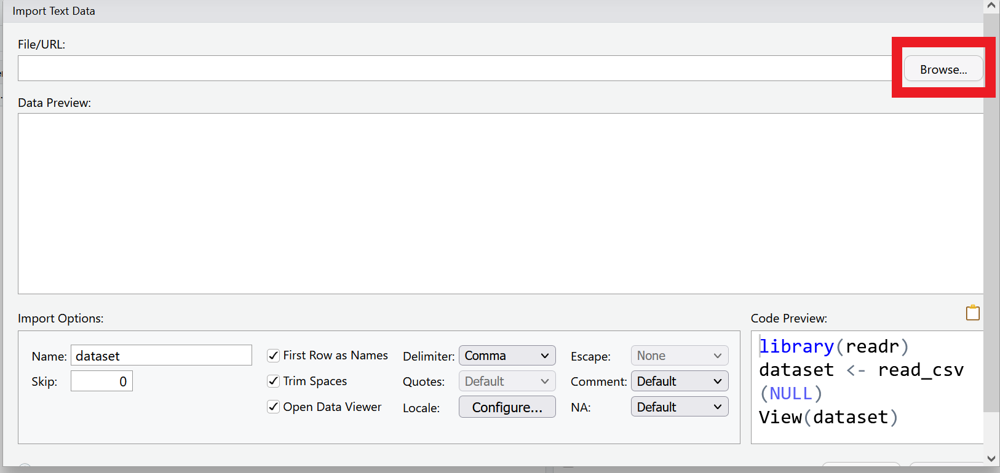
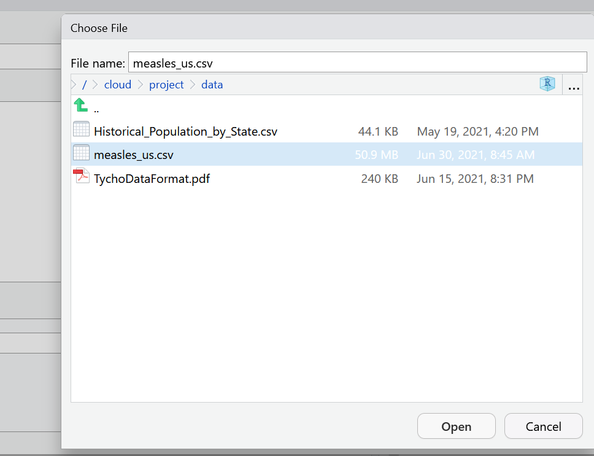
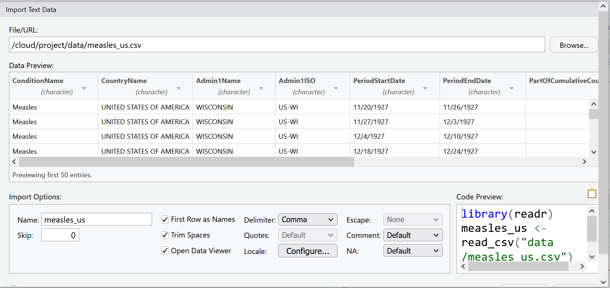

# (PART\*) Session II {-}

# Welcome to the Tidyverse

In this lesson and the next, we will be using a group of packages which are part of what is known as the **`tidyverse`** - "an opinionated collection of R packages designed for data science. All packages share an underlying design philosophy, grammar, and data structures."^[https://www.tidyverse.org/], developed by Hadley Wickham.

These packages include : 

- **`readr`** for importing data into R
- **`dplyr`** for handling common data wrangling tasks for tabular data
- **`tidyr`** which enables you to swiftly convert between different data formats (long vs. wide) for plotting and analysis
- **`lubridate`** for working with dates
- **`ggplot2`** for visualizing data (we'll explore this package in the next chapter).


For the full list of tidyverse packages and documentation visit [tidyverse.org](https://www.tidyverse.org/)
You can install these packages individually, or you can install the entire tidyverse in one go.

## What is Tidy Data?
Data is considered "tidy" if it follows three rules:

1. Each column is a variable
2. Each row is an observation
3. Each cell is a single value^[read more about tidy data https://cran.r-project.org/web/packages/tidyr/vignettes/tidy-data.html]

Data "in the wild" often isn't tidy, but the tidyverse packages can help you create and analyze tidy datasets.

```{r echo=F}
knitr::include_graphics("images/tidy-data.PNG")
```

## Getting set up

1. Sign in to RStudio Cloud (Or, if you haven't already, sign up for a free account at RStudio Cloud https://rstudio.cloud/plans/free)
2. Go to the RStudio Cloud class project for this session https://rstudio.cloud/project/4260029
3.Note the text that marks this as a Temporary Copy. Select the
    `Save a Permanent Copy` button to begin working!
4. Create a new script called `measles_script.R`

**Reminder:** You can open a new R script in the following ways:

1. Go to the menu bar `File > New File > R Script`
2. In the toolbar below the menu bar, select the new blank file icon, and then R Script from the menu bar.
3. In the Files pane, select the New Blank File Icon, and then R Script
4. Use the keyboard shortcut `Ctrl+Shift+N` (PC) or `Shift+Command+N`(Mac)


## Install
First we are going to use `install.packages()` to install **`tidyverse`**, if you haven't already. Then we are going to load **`tidyverse`** with the `library()` function. You only need to install a package once, but you will load it each time you start a new r session. To learn more about **`dplyr`** and **`tidyr`** after the workshop, you may want to check out this [handy data transformation with **`dplyr`** cheatsheet](https://github.com/rstudio/cheatsheets/raw/master/data-transformation.pdf) and this [one about **`tidyr`**](https://github.com/rstudio/cheatsheets/raw/master/data-import.pdf).

```{r tidyverse}
#install tidyverse if you haven't yet
#install.packages("tidyverse")

#load tidyverse
library(tidyverse)
```

## The Data
For this lesson we will be using data which comes from [Project Tycho](https://www.tycho.pitt.edu/) - an open data project from the University of Pittsburgh which provides standardized datasets on numerous diseases to aid global health research. 

Throughout this lesson, we will be using a dataset from Project Tycho featuring historical counts of measles cases in the U.S.. We want to clean and present this data in a way that makes it easy to see how measles cases fluctuated over time. In the next lesson, we'll start visualizing this cleaned up data.

A useful feature of Project Tycho data is their use of a common set of variables. Read more about their [data format]("https://osf.io/paefw/").

## Importing data

Now let's import the data we'll be working with. You can import data with code, or you can use RStudio's GUI. Let's look at both.

In the environment pane, select the button that says `Import Dataset` and choose the option `From text (readr)`. This means we are going to be using the **`readr`** package, which is part of the **`tidyverse`** to read a file.  

```{r echo=F}
knitr::include_graphics("images/import_data.png")
```

Select `Browse` in the dialog box that opens, and navigate to your `data` folder and choose the file called `measles_us.csv`

```{r echo=F}

```
```{r echo=F}

```

A new window will open with a spreadsheet view of the data. We can use this window to make some choices about how the data is imported.

```{r echo=F}

```

RStudio will use the file name as the default name for your dataset, but you could change it to whatever you want. In this case `measles_us` works pretty well.

RStudio will also try to guess the data type of your columns. It will mostly get it right, but it is not unusual that you will manually need to tell it what data type certain columns are. 

For example, let's look at the columns `PeriodStartDate` and `PeriodEndDate`. These columns contain dates, but RStudio wants to read them as character data. This is very common when importing data. Let's change the first column `PeriodStartDate` to the date data type, by using the drop down menu to select date data. We'll learn another way to change data types later in this lesson and take care of `PeriodEndDate` then.

```{r echo=F}

```

You will be asked to confirm that the input format of the date is `%m/%d/%Y` which is like writing `mm/dd/YYYY`. The program needs to know what the correct input date is so it can return the right output date `YYYY-mm-dd`, the international standard date format.

```{r echo=F}
knitr::include_graphics("images/data_dropdown_confirm.PNG")
```

Now our data is ready to import. We can select the import button. As you may have noticed, the code behind this import dialog box is also being generated. 

We can find the code in our History pane. Highlight the line of code and use the `To Source` button to add it to the script.


So what does all this code actually mean?

We are using a function from the **`readr`** package called `read_csv()`. This function takes as an argument the path to where the file is located. This can take the form of an absolute path, a relative path to the working directory, or a url. The `col_types` argument lets you specify the data type by column name.


```{r read-csv, echo=TRUE}
library(readr)
measles_us <- read_csv(
  "data/measles_us.csv",
  col_types = cols(
    PeriodStartDate = col_date(format = "%m/%d/%Y")))
```

## Exploring Data

After reading the data, you will typically want to start exploring it. There are several ways of doing this. Let's review some ways of exploring data that we learned in the last chapter. `View()` opens the data as a file in your documents pane. 

```{r View-data, eval=FALSE, echo=TRUE}
View(measles_us)
```

Use `summary()` to look at each column

```{r measles-summary}
summary(measles_us)
```

You can look at the beginning of your dataset with `head()`.

```{r measles-head}
head(measles_us)
```

or the end of your dataset with `tail()`
```{r measles-tail}
tail(measles_us)
```

Notice that this prints out the first and last 6 rows of your data frame to the console in what is called a *tibble*. A tibble is a form of data frame that is particular to the tidyverse. The differences rest mainly it how it reads and displays data, but for the purposes of this class we will use the terms somewhat interchangeably. The tibble printed from `head()` and `tail()` will only print as many columns as can fit on the width of your monitor.

The `glimpse()` function which is part of the **`tidyverse`** package **`tibble`**, lets you see the column names and data types clearly.

```{r glimpse}
#summary of columns and first few entries
glimpse(measles_us)
```

Some of our variables only have one value. For example `ConditionName` is always going to be "Measles" and `CountryName` is always going to be "UNITED STATES OF AMERICA", because this dataset is a dataset of measles case counts in the US. But you don't have to take my word for it! Let's use some tools to explore distinct values. First the **`dplyr`** function `distinct()` will print all the distinct values in a given column. 

```{r distinct-condition}
distinct(measles_us, ConditionName)
```
As expected, we have only one distinct value in this column.

To contrast, let's run `distinct()` on `Admin1Name`.

```{r distinct-state}
distinct(measles_us, Admin1Name)
```

Now we get a clearer idea that this column contains names of US states and territories.

We might want, not just the distinct values, but also counts of how often each distinct value occurs. For that we can use `count()`

```{r count-function}
count(measles_us, Admin1Name)
```

This might be helpful information to have on its own. Let's save this to an object that we can refer to later.

```{r}
Admin1_counts <- count(measles_us, Admin1Name)
```


We might also notice that some of our columns have a number of NA values. Let's take a closer look at one of these. We can use the function `is.na()` to test for the presence of NAs in our data. `is.na()` will return a vector of values TRUE or FALSE. TRUE if the value is NA, FALSE if it is not.

```{r missing-data, results='hide'}
is.na(measles_us$Admin2Name)
```

We can use that together with `sum()` to find out how many NAs are in the column.

```{r sum-na}
sum(is.na(measles_us$Admin2Name))
```
To find out how many NAs there are per column of our dataset, we can use the function `colSums()`.

```{r colSums}
colSums(is.na(measles_us))
```

We see that `Admin2Name` and `CityName` variables have many missing values, and the `DiagnosisCertainty` column is entirely missing (i.e. the number of missing values is the same as the number of observations in the dataset). This is something to consider as we figure out what variables we want to focus our analysis on.

### Challenge 

::: {.shaded .question data-latex=""}

1. Test out `distinct()` with a few other columns in `measles_us`.
2. `unique()` and `table()` are two base R functions that work similarly to `distinct()` and `count()`. Try running `unique(measles_us$Admin1Name)` and `table(measles_us$Admin1Name)`. How do the results differ from `distinct()` and `count()`? Which do you prefer?
3. Try to run `unique()` and `table()` on a few more variables in measles_us()
4. Look up the `colSums()` in RStudio Help pane. What are some related functions and what do they do? Test them out!
:::

## Wrangling data with `dplyr`

Now that we have a better sense of what's in our data, we can start to getting it into shape for analysis. Of all the **`tidyverse`** packages, **`dplyr`** might be the one you wind up using the most. **`dplyr`** is characterized by its easy to understand "verb" functions, such as `count()`, which we've already used. Some others are:

- `select()` - selects columns by name
- `filter()` - filters rows by some condition
- `mutate()` - creates new columns based on existing values of existing columns
- `group_by()` - groups data
- `summarize()` - summarizes rows to a single value
- `arrange()` - changes the order of rows

If you're familiar at all with SQL, you may that some of these **`dplyr`** functions have similar names or purposes as SQL commands.

## Subsetting Data

To work efficiently, we want to work with the smallest version of our dataset possible that still contains all the information we need. That means getting rid of extraneous columns and rows.
In the last chapter, we learned that we can use brackets to subset vectors and data frames.

For example:
```{r bracket-review, collapse=TRUE}
# use bracket notation to select the value in the 5th row, 7th column
measles_us[5,7]

#use bracket notation to select the 3rd row
measles_us[3,]

#use bracket notation to select the 10th column
measles_us[10]

#use bracket notation to select a range of rows and columns
measles_us[6:10, 3:9]

```

### Subsetting Columns with `Select()`

**`dplyr`** makes this subsetting task a bit easier, because we can use `select()` to choose columns by name rather than index. 

The first argument to this function is the name of the data object, which in this case is `measles_us`, and the subsequent arguments are the names of the columns we want to keep, separated by commas.

Let's try selecting the `Admin1Name` column and the `CountValue` column.

```{r}
select(measles_us, Admin1Name, CountValue)
```

As you can imagine, if you had a number of columns to select, it could get tiresome to write them all out. One way around this is to use a colon `:` to name a range of adjacent columns, just as we used the colon with brackets.

```{r colon}
select(measles_us, ConditionName:Admin1ISO)
```

Another helpful tool that the **`tidyverse`** provides is the **`pipe`** operator which looks like **`%>%`**. The pipe is made available via the **`magrittr`** package, installed automatically with **`dplyr`**. If you use RStudio, you can type the pipe with <kbd>Ctrl</kbd> + <kbd>Shift</kbd> + <kbd>M</kbd> if you have a PC or <kbd>Cmd</kbd> + <kbd>Shift</kbd> + <kbd>M</kbd> if you have a Mac.

With the pipe you start with your data object and pipe it to the function, rather than naming the data as your first argument. So, the pipe becomes especially valuable when you have a number of steps that you want to connect. Another benefit of using the pipe in RStudio is that the interface will supply column names to you in the auto complete. This helps so you do not need to remember sometimes lengthy column names, and you are less likely to get an error from a typo.

```{r}
measles_us %>%
  select(Admin1Name, PartOfCumulativeCountSeries)
```

Now, let's think through which columns we want for our analysis and save this to a new object called `measles_us_mod`. It's always a good idea to create new objects when you make major changes to your data.

For this exercise, we want to look at trends in number of measles cases over time. To do that, we'll need to keep our `CountValue` variable, as and the date variables (`PeriodStartDate` and `PeriodEndDate`), as well as the`PartOfCumulativeCountSeries` variable, which will help us understand how to use the dates (more on this later).  The first five columns each have only one value. So it might be redundant to keep those, although if we were combining them with other Project Tycho datasets they could be useful.  It might be interesting to get a state-level view of the data, so let's keep `Admin1Name`. But we saw that there are a number of missing values in our `Admin2Name` and `CityName` variables, so they might not be very useful for our analysis.

```{r select}
measles_us_mod <-
  measles_us %>%
    select(
     Admin1Name,
     PeriodStartDate,
     PeriodEndDate,
     PartOfCumulativeCountSeries,
     CountValue
)

# inspect our new data frame
glimpse(measles_us_mod)
``` 

Now when you look in your environment pane, you should see your new object which as the same number of rows but 6 instead of 11 columns (or variables)

### Renaming columns

Sometimes when you receive data, you may find that the column names are not very descriptive or useful, and it may be necessary to rename them. You can assign new names to columns when you select them `select(newColumnName = OldColumnName)` or you can use the `rename()` function. Like naming objects, you should use a simple, descriptive, relatively short name without spaces for your column names.

```{r rename}
measles_us_mod <-
  measles_us_mod %>% 
    rename(State = Admin1Name)
```

### Subsetting rows with `filter()` 

`select()` lets us choose columns. To choose rows based on a specific criteria, we can use the `filter()` function. The arguments after the data frame are the condition(s) we want for our final dataframe to adhere to. Specify conditions using logical operator:

| operator | meaning                  |
|:---------|:-------------------------|
| ==       | exactly equal            |
| !=       | not equal to             |
| \<       | less than                |
| \<=      | less than or equal to    |
| \>       | greater than             |
| \>=      | greater than or equal to |
| x\|y     | x or y                   |
| x&y      | x and y                  |
| !x       | not x                    |

We'll come back to our problem of different time spans in a moment. First, let's try filtering our data by just one condition. We want to see just the rows that contain counts from Maryland.

```{r filter-one-condition}
measles_us_mod %>% filter(State == "MARYLAND")
```

:::{.shaded .important}
When matching strings you must be exact. R is case-sensitive. So `State == "Maryland"` or `State == "maryland"` would return 0 rows.
:::

You can add additional conditions to filter by, separated by commas or other logical operators like `&`, `>`, and `>`.

Below we want just the rows for Maryland, and only include periods where the count was more than 500 reported cases. Note that while you need quotation marks around character data, you do not need them around numeric data.

```{r filter-multiple}
measles_us_mod %>%
  filter(State == "MARYLAND" & CountValue > 500)

```

We can filter based on a vector of values with the`%in%` operator. Remember that our dataset contains data for US states and territories. To do this we will make use of a nifty built-in R vector called `state.name`. We'll keep only the rows where the `State` column has a value that matches one of the values in that vector. Because the state names in our data are in all upper case letters, we will use the base R function `toupper()` (to upper case).


```{r filter-vector}
measles_states_only <-
  measles_us_mod %>% 
  filter(State %in% toupper(state.name))
```


Let's save this output to a new object `measles_states_only`. Notice how we now have fewer rows than we had in our `measles_us_mod object`. 

We could alternatively have used negation with the names of the values we specifically wanted to exclude.

```{r}
measles_states_only <- measles_us_mod %>% 
  filter(!State %in% c("PUERTO RICO", "GUAM", "AMERICAN SAMOA", "NORTHERN MARIANA ISLANDS", "VIRGIN ISLANDS, U.S.", "DISTRICT OF COLUMBIA"))

```

Great! Our dataset is really shaping up. Let's also take a closer look at our date columns. If you look at the first several rows, it looks like each row of our dataset represents about a discrete week of measles case counts. But (as you can read in the Tycho data documentation) there are actually two date series in this dataset - non-cumulative and cumulative. Which series a row belongs to is noted by the `PartofCumulativeCountSeries`, which as the value `0` if a row is non-cumulative, and `1` if the row is part of a cumulative count.

To keep things consistent. Let's filter our dataset so we only have the non-overlapping discrete weeks.

```{r filter-cumulative}
measles_non_cumulative <- 
  measles_states_only %>% 
  filter(PartOfCumulativeCountSeries==0)
```

Once again, we have fewer rows than we started with. 

Now do some more with our date variables.

## Working with Dates

Working with dates in your dataset can be tricky. The **`tidyverse`** provides the **`lubridate`** package to make this task easier. Because of it's specialized focus, it's not loaded with the rest of the **`tidyverse`** packages. So let's load it now:

```{r load-lubridate}
library(lubridate)
```

As we saw when we loaded our measles dataset, R often will try to read in date variables as character data. But, if we want to be able to do calculations with our dates, or graph some time information, we need the dates to be recognized as date objects. 

**`lubridate`** has a number of functions for parsing and creating dates. Let's say we have a character string that looks like a date in a typical US date format: month, day, year. We can parse this with the function called `mdy()`

```{r mdy}
my_date <- "03/14/2022"
real_date <- mdy(my_date)

real_date
```
Note it changes the date to a standard format Year-Month-Day. Let's look at the classes of our two dates.

```{r compare-dates, collapse=TRUE}
class(my_date)
class(real_date)
```

Let's try parsing a couple more dates in different formats with related functions `dmy()` and `ymd()`:

```{r more-dates, collapse=TRUE}
dmy("14-03-2022")
ymd("20220314")
```
Note that you can use different types of separators between the date components or no separators at all. 

Now let's use this new function to change `PeriodEndDate` to a date object. Currently, the dates are in Month, Day, Year format. Notice that since we are changing one column of data, we must save the results of our function directly to that column. We can use the `class()` function to check that it worked.

```{r}
measles_non_cumulative$PeriodEndDate <- mdy(measles_non_cumulative$PeriodEndDate)

class(measles_non_cumulative$PeriodEndDate)
```

**`lubridate`** also has functions that will let you pull out different components of dates. For example:

```{r date-components, collapse=TRUE}
year(real_date)
month(real_date)
day(real_date)
wday(real_date)
wday(real_date, label = TRUE)
```

We'll come back to that idea shortly.

### Date intervals, durations, and periods
We can also use **`lubridate`** to work with time durations, intervals, and periods, and to do arithmetic with dates. 

The measles data has a start date and an end date variable. This dataset has a mix of discrete 6 day periods and cumulative periods.  Let's look at that a little more closely. First we create an interval object based on those two dates with the `interval()` function.

```{r intervals}
measles_weeks <- measles_us_mod

measles_weeks$PeriodEndDate <- mdy(measles_weeks$PeriodEndDate)

measles_intervals <-
  interval(start=measles_weeks$PeriodStartDate, end=measles_weeks$PeriodEndDate)

head(measles_intervals)
```

To figure out how many days are in our interval we can use a duration function. Duration functions return the number of seconds in a provided value.

```{r durations, collapse=TRUE}
duration(10)
dminutes(10)
dhours(10)
ddays(10)
```

```{r}
measles_days <- 
  measles_intervals / ddays(1)

head(measles_days)
```
The table function will tell us how many times each interval appears

```{r}
as_tibble(table(measles_days))
```


## Creating new columns with `mutate()`

Frequently you'll want to create new columns based on the values in existing columns, for example to do unit conversions, or to find the ratio of values in two columns. For this you can use the `mutate()` function. The `transmute()` function is similar, but **replaces** old columns with the new one.

We can use `mutate()` plus what we learned about **`lubridate`** functions to create a `Year` variable based on our current date variables. This will be useful later on for grouping purposes. `mutate()` takes as an argument the name of the new column you want to create and an expression used to create it.

```{r}
measles_w_year <- 
  measles_non_cumulative %>% 
  mutate(Year=year(PeriodStartDate))

glimpse(measles_w_year)
  
```


## Grouping and Summarizing data

Many data analysis tasks can be approached using the *split-apply-combine* paradigm: split the data into groups, apply some analysis to each group, and then combine the results. **`dplyr`** makes this very easy through the use of the `group_by()` function.

`group_by()` is often used together with `summarize()`, which collapses each group into a single-row summary of that group. `group_by()` takes as arguments the column names that contain the **categorical** variables for which you want to calculate the summary statistics.

How can we calculate the total number of measles cases for each year?

First we need to group our data by year using our new `Year` column.

```{r groupby}

yearly_count_state <-
  measles_w_year %>%
  group_by(Year)

head(yearly_count_state)
```

When you inspect your new data frame, everything should look the same. Grouping prepares your data for summarize, but it does not do anything visually to the data.

Now let's trying summarizing that data. `summarize()` condenses the value of the group values to a single value per group. Like `mutate()`, we provide the function with the name of the new column that will hold the summary information. In this case, we will use the `sum()` function on the `CountValue` column and put this in a new column called `TotalCount`. Summarize will drop the columns that aren't being used.

```{r count-by-year}
#Get totals for each state each year.
yearly_count <-
  measles_w_year %>%
  group_by(Year) %>%
  summarise(TotalCount = sum(CountValue))

head(yearly_count)
```

A more useful view might be to look for yearly totals of case counts by state. We can group by two variables, Year, and then State.

```{r count-by-state}
#Get totals for each state each year.
yearly_count_state <-
  measles_w_year %>%
  group_by(Year, State) %>%
  summarise(TotalCount = sum(CountValue))

head(yearly_count_state)
```

Notice how the use of pipes really comes in handy here. It saved us from having to create and keep track of a number of intermediate objects.

## Sorting datasets with `arrange()`

Which state in which year had the highest case count? To easily find out, we can use the function `arrange()`. One of the arguments must be the column you want to sort on.

```{r arrange}
yearly_count_state %>% arrange(TotalCount)
```

By default, arrange sorts in ascending order. To sort by descending order we use together with the `desc()` function.

```{r arrange-desc}
yearly_count_state %>% arrange(desc(TotalCount))
```


## Joining Datasets

Of course, looking at total counts in each state is not the most helpful metric without taking population into account. To rectify this, let's try joining some historical population data with our measles data.

First we need to import the population data^[population data retrieved from the FRED, the Federal Reserve Bank of St. Louis Economic Data, https://fred.stlouisfed.org/release/tables?rid=118&eid=259194].

```{r}
#load csv of populations by state over time, changing some of the datatypes from default
hist_pop_by_state <-
  read_csv(
    "https://osf.io/download/62cdb7d8779f1710fb070f06/")

head(hist_pop_by_state)
```

```{r eval=FALSE}
View(hist_pop_by_state)
```


### Long vs Wide formats

Remember that for data to be considered "tidy", it should be in what is called "long" format. Each column is a variable, each row is an observation, and each cell is a value. Our state population data is in "wide" format, because State Name is being treated as a variable, when it is really a value. Wide data is often preferable for human-readability, but is less ideal for machine-readability. To be able to join this data to our measles dataset, it needs to have 3 columns - Year, State Name, and Population. 

We will use the package **`tidyr`** and the function `pivot_longer` to convert our population data to a long format, thus making it easier to join with our measles data.

Each column in our population dataset represents a state. To make it tidy we are going to reduce those to one column called State with the state names as the values of the column. We will then need to create a new column for population containing the current cell values. To remember that the population data is provided in 1000s of persons, we will call this new column pop1000.

`pivot_longer()` takes four principal arguments:

1.  the data
2.  *cols* are the names of the columns we use to fill the new values variable (or to drop).
3.  the *names_to* column variable we wish to create from the *cols* provided.
4.  the *values_to* column variable we wish to create and fill with values associated with the *cols* provided.

```{r}
library(tidyr)
hist_pop_long <- hist_pop_by_state %>%
  pivot_longer(ALASKA:WYOMING,
               names_to = "State",
               values_to = "pop1000")
```

```{r eval=FALSE}
View(hist_pop_long)
```

Now our two datasets have similar structures, a column of state names, a column of years, and a column of values. Let's join these two datasets by the state and year columns. Note that if both sets have the same column names, you do not need to specify anything in the by argument. We use a left join here which preserves all the rows in our measles dataset and adds the matching rows from the population dataset.

```{r}
joined_df <-
  left_join(yearly_count_state, hist_pop_long, by=c("State" = "State", "Year" = "DATE" ))

joined_df
```

Now we can use our old friend `mutate()` to add a rate column calculated from the count and pop1000 columns.

```{r}
#Add column for rate (per 1000) of measles
measles_yearly_rates <-
  joined_df %>% 
  mutate(rate = TotalCount / pop1000)

head(measles_yearly_rates)
```
Now our data is ready to be analyzed.

## Writing Data

If you wanted to be able to share this new dataset outside of R, you could turn it into a new csv file with the `write_csv()` function, which like `read_csv()` is part of the **`readr`** package. `write_csv()` requires two arguments - the name of the object you want to write, and the path of the file it will be written to.

```{r write-csv}
write_csv(measles_yearly_rates, "data_output/measles_yearly_rates.csv")
```

### Challenge 

::: {.shaded .question data-latex=""}
Try using `write_csv()` to turn the `yearly_count` and `yearly_count_state` objects to csv files.
