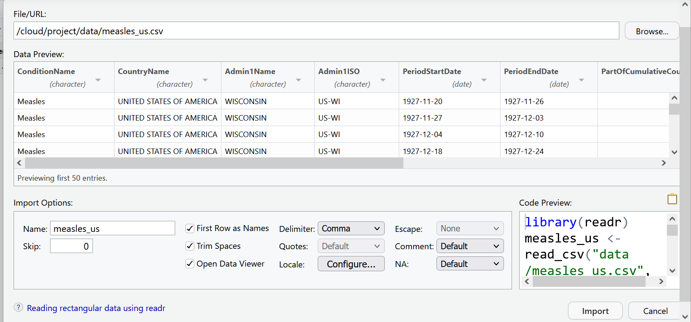

# (PART\*) Session II {-}

# Welcome to the Tidyverse

In this lesson and the next, we will be using a group of packages which are part of what is known as the **`tidyverse`** - "an opinionated collection of R packages designed for data science. All packages share an underlying design philosophy, grammar, and data structures."^[https://www.tidyverse.org/], developed by Hadley Wickham.

These packages include : 

- **`readr`** for importing data into R
- **`dplyr`** for handling common data wrangling tasks for tabular data
- **`tidyr`** which enables you to swiftly convert between different data formats (long vs. wide) for plotting and analysis
- **`lubridate`** for working with dates
- **`ggplot2`** for visualizing data (we'll explore this package in the next chapter).


For the full list of tidyverse packages and documentation visit [tidyverse.org](https://www.tidyverse.org/)
You can install these packages individually, or you can install the entire tidyverse in one go.

## What is Tidy Data?
Data is considered "tidy" if it follows three rules:

1. Each column is a variable
2. Each row is an observation
3. Each cell is a single value^[read more about tidy data https://cran.r-project.org/web/packages/tidyr/vignettes/tidy-data.html]

Data "in the wild" often isn't tidy, but the tidyverse packages can help you create and analyze tidy datasets.


## Install
First we are going to use `install.packages()` to install **`tidyverse`**. Then we are going to load **`tidyverse`** with the `library()` function. You only need to install a package once, but you will load it each time you start a new r session. To learn more about **`dplyr`** and **`tidyr`** after the workshop, you may want to check out this [handy data transformation with **`dplyr`** cheatsheet](https://github.com/rstudio/cheatsheets/raw/master/data-transformation.pdf) and this [one about **`tidyr`**](https://github.com/rstudio/cheatsheets/raw/master/data-import.pdf).

```{r tidyverse}
#install tidyverse if you haven't yet
#install.packages("tidyverse")

#load tidyverse
library(tidyverse)
```

## The Data
For this lesson we will be using data which comes from [Project Tycho](https://www.tycho.pitt.edu/) - an open data project from the University of Pittsburgh which provides standardized datasets on numerous diseases to aid global health research. 

Throughout this lesson, we will be using a dataset from Project Tycho featuring historical counts of measles cases in the U.S.. We want to clean and present this data in a way that makes it easy to see how measles cases fluctuated over time. In the next lesson, we'll start visualizing this cleaned up data.

A useful feature of Project Tycho data is their use of a common set of variables. Read more about their [data format]("https://osf.io/paefw/").

## Importing data

Now let's import the data we'll be working with. You can import data with code, or you can use RStudio's GUI. Let's look at both.

In the environment pane, select the button that says `Import Dataset` and choose the option `From text (readr)`. This means we are going to be using the **`readr`** package, which is part of the **`tidyverse`** to read a file.  

```{r echo=F}

```

Select `Browse` in the dialog box that opens, and navigate to your `data` folder and choose the file called `measles_us.csv`

```{r echo=F}
knitr::include_graphics("images/import_browse.png")
```
```{r echo=F}
knitr::include_graphics("images/import_browse2.png")
```

A new window will open with a spreadsheet view of the data. We can use this window to make some choices about how the data is imported.

```{r echo=F}
knitr::include_graphics("images/import_window.png")
```

RStudio will use the file name as the default name for your dataset, but you could change it to whatever you want. In this case `measles_us` works pretty well.

RStudio will also try to guess the data type of your columns. It will mostly get it right, but it is not unusual that you will manually need to tell it what data type certain columns are. 

For example, let's look at the columns `PeriodStartDate` and `PeriodEndDate`. These columns contain dates, but RStudio wants to read them as character data. This is very common when importing data. Let's change the first column `PeriodStartDate` to the date data type, by using the drop down menu to select date data. We'll learn another way to change data types later in this lesson and take care of `PeriodEndDate` then.

```{r echo=F}
knitr::include_graphics("images/data_dropdown.PNG")
```

You will be asked to confirm that the input format of the date is `%m/%d/%Y` which is like writing `mm/dd/YYYY`. The program needs to know what the correct input date is so it can return the right output date `YYYY-mm-dd`, the international standard date format.

```{r echo=F}

```

Now our data is ready to import. Your import screen should look like:


```{r echo=F}

```

We can select the import button. But as you may have noticed, the code behind this import dialog box is also being generated. 

We can find the codeUse the clipboard icon to copy the code. 

Let's paste that into our `script.R` file.

So what does all this code actually mean?

We are using a function from the **`readr`** package called `read_csv()`. This function takes as an argument the path to where the file is located. This can take the form of an absolute path, a relative path to the working directory, or a url. The `col_types` argument lets you specify the data type by column name, and the `na` argument lets you specify the value that should be read as `NA` in your data set.


```{r read_csv, echo=TRUE}
library(readr)
measles_us <- read_csv(
  "data/measles_us.csv",
  col_types = cols(
    PeriodStartDate = col_date(format = "%m/%d/%Y")),
    na = "NA"
)
```

```{r view_data, eval=FALSE, echo=TRUE}
View(measles_us)
```

After reading the data, you will typically want to inspect it and make sure everything looks okay. There are several ways of doing this. In your script above, `View()` opens the data as a file in your documents pane. 

The most basic way is to call the name of the object as we did in the last lesson with vectors. Since we used `read_csv()`, the object will print as a tibble. The problem with this, is that it will only show as many columns as can fit in your window. So it's good to know a few other ways to look at your data.

```{r inspect}
measles_us
```

The `glimpse()` function lets you see the column names and data types clearly. This function is part of the **`tibble`** package which is loaded with the core **`tidyverse`**.

```{r glimpse}
#summary of columns and first few entries
glimpse(measles_us)
```

You can also use the `head()` function to view the first `n` rows. The function defaults to 6 rows, but you can specify the number you want with an argument. Below we ask to see just the first 5 rows.

```{r head}
#first n rows (defaults to 6)
head(measles_us, n = 5)
```

## Working with columns

### `Select()`

To select columns of a data frame, use `select()`. This is a great way to create a smaller data frame with only the variables you are interested in.

`select()` is a function. Remember that functions have arguments which go inside the parentheses. The *first argument* to this function is the name of the data object, which in this case is `measles_us`, and the subsequent arguments are the names of the columns we want to keep, separated by commas. 

Let's try selecting the `Admin1Name` column and the `CountValue` column. 

```{r}
select(measles_us, Admin1Name, CountValue)
```

As you can imagine, if you had a number of columns to select, it could get tiresome to write them all out. One way around this is to use a colon `:` to name a range of adjacent columns.  

```{r colon}
select(measles_us, ConditionName:Admin1ISO)
```

Another helpful tool that the **`tidyverse`** provides is the **`pipe`** operator which looks like **`%>%`**. The pipe is made available via the **`magrittr`** package, installed automatically with **`dplyr`**. If you use RStudio, you can type the pipe with <kbd>Ctrl</kbd> + <kbd>Shift</kbd> + <kbd>M</kbd> if you have a PC or <kbd>Cmd</kbd> + <kbd>Shift</kbd> + <kbd>M</kbd> if you have a Mac.

With the pipe you start with your data object and pipe it to the function, rather than naming the data as your first argument. So, the pipe becomes especially valuable when you have a number of steps that you want to connect. Another benefit of using the pipe in RStudio is that the interface will supply column names to you in the auto complete. This helps so you do not need to remember sometimes lengthy column names, and you are less likely to get an error from a typo.

```{r}
measles_us %>% 
  select(Admin1Name, PartOfCumulativeCountSeries)
```

Now unfortunately, we did not save this to an object, so while it prints out to the console, we cannot really do anything with these results. So now, let's think through which columns we want for our analysis and save this to a new object called `measles_us_mod`. 

So if we look at our data, we see that the columns `ConditionName`, `CountryName`, and `SourceName` have the same values throughout the data set. So it seems redundant to keep those.  `Admin1ISO` has redundant information to `Admin1Name`, so we can probably get rid of that as well. For this particular analysis we are going to take a state level view of measles, so we do not need `Admin2Name` and `CityName` either. That leaves us with `Admin1Name`, `PeriodStartDate`, `PeriodEndDate`, `PartOfCumulativeCountSeries`, and `CountValue`. 

```{r select}
measles_us_mod <-
  measles_us %>% 
    select(
    Admin1Name,
    PeriodStartDate,
    PeriodEndDate,
    PartOfCumulativeCountSeries,
    CountValue
  )

#inspect our new data frame
glimpse(measles_us_mod)
```

Now when you look in your environment pane, you should see your new object which as the same number of rows but 6 instead of 11 columns (or variables)

### Renaming columns

Sometimes when you receive data, you may find that the column names are not very descriptive or useful, and it may be necessary to rename them. You can assign new names to columns when you select them `select(newColumnName = OldColumnName)` or you can use the `rename()` function. Like naming objects, you should use a simple, descriptive, relatively short name without spaces for your column names.

```{r}
measles_us_mod <-
  rename(measles_us_mod, State = Admin1Name)
```


### Creating new columns with `mutate()`

Frequently you'll want to create new columns based on the values in existing columns, for example to do unit conversions, or to find the ratio of values in two columns. For this you can use the `mutate()` function. The `transmute()` function is similar, but **replaces** old columns with the new one.

We know that each row in our dataset represents some time span, but we're not sure what that span is. Below we use `mutate()` to create a new column called Span, which gives the number of days between the PeriodEndDate column and the PeriodStartDate column. This is why it is important to make sure your date columns are parsed properly as dates when importing your data. If the dates had been left as character data, it would not have been possible to do arithmetic with them. 

```{r}
measles_us_mod <- 
  mutate(measles_us_mod, Span = PeriodEndDate - PeriodStartDate)

measles_us_mod
```

It's hard to get a sense of what different time spans are present in our data. We can use the `count()` function to help us figure that out.

```{r count}
count(measles_us_mod,Span)
```

All those different time spans will get us into trouble when we try to work with the data. So next we need to filter the dataset for only the rows we want. 

## Working with rows

### `filter()`

`select()` lets us choose columns. To choose rows based on a specific criteria, we can use the `filter()` function. The arguments after the data frame are the condition(s) we want for our final dataframe to adhere to. Specify conditions using logical operator:

| operator | meaning                  |
|:---------|:-------------------------|
| ==       | exactly equal            |
| !=       | not equal to             |
| \<       | less than                |
| \<=      | less than or equal to    |
| \>       | greater than             |
| \>=      | greater than or equal to |
| x\|y     | x or y                   |
| x&y      | x and y                  |
| !x       | not x                    |

We'll come back to our problem of different time spans in a moment. First, let's try filtering our data by just one condition. We want to see just the rows that contain counts from Maryland.

```{r filter-one-condition}
measles_us_mod %>% filter(State == "MARYLAND")
```

:::{.shaded .important}
When matching strings you must be exact. R is case-sensitive. So `State == "Maryland"` or `State == "maryland"` would return 0 rows.
:::

You can add additional conditions to filter by, separated by commas or other logical operators like `&`, `>`, and `>`. 

Below we want just the rows for Maryland, and only include periods where the count was more than 500 reported cases. Note that while you need quotation marks around character data, you do not need them around numeric data.

```{r filter-multiple}
measles_us_mod %>% 
  filter(State == "MARYLAND" & CountValue > 500)

```

### Grouping and Summarizing data

Many data analysis tasks can be approached using the *split-apply-combine* paradigm: split the data into groups, apply some analysis to each group, and then combine the results. **`dplyr`** makes this very easy through the use of the `group_by()` function.

`group_by()` is often used together with `summarize()`, which collapses each group into a single-row summary of that group. `group_by()` takes as arguments the column names that contain the **categorical** variables for which you want to calculate the summary statistics.

Let's return to our `measles_us_mod` data frame. To analyze this further, we need to separate out the rows that represent cumulative counts from the rows that have a fixed interval. So we use `filter()` as we did above, this time saving to a new object called `non_cumulative_period`.

```{r filter-non-cum}
#filter out cumulative counts

non_cumulative <-
  measles_us_mod %>%
    filter(PartOfCumulativeCountSeries == 0)
```

How can we calculate the total number of measles cases in each state for each reported time period?

First we need to group our data by state, and then group by period. Remember that in our original data set each state contained counts for multiple municipalities. That means in our current data frame there will be multiple rows for each period that needs to be condensed.

```{r group}
#group - prepares for summary calculations
count_by_period <-
  non_cumulative %>%
  group_by(State, PeriodStartDate)

count_by_period
```

When you inspect your new data frame, everything should look the same. Grouping prepares your data for summarize, but it does not do anything visually to the data.

Now let's trying summarizing that data. `summarize()` takes the dataframe as it's first argument, then you need to provide some calculation and the name for the new column where the results of that calculation will go. In this case, we will use the `sum()` function on the CountValue column and put this in a new column called TotalCount

```{r summarize}
count_by_period <-
  non_cumulative %>%
  group_by(State, PeriodStartDate) %>% 
  summarize(TotalCount = sum(CountValue))
```

Notice how the use of pipes really comes in handy here. It saved us from having to create and keep track of a number of intermediate objects.

Now each row in our dataset represents a week of data. It might be better if we can look at yearly trends. So, let's try separating out the year from PeriodStartDate into its own column. In addition to `mutate()`, we will also use the `year()` function from **`lubridate`**. Since **`lubridate`** is not loaded with the core **`tidyverse`** let's go ahead and load that now.

```{r lubridate}
library(lubridate)
```

Remember, you only need to install a package once, but you have to load it with each new session.

```{r count-by-period}
#Get year in separate column from PeriodStartDate
count_by_period <- 
  count_by_period %>% 
  mutate(Year = year(PeriodStartDate))

count_by_period
```

Now we can do our grouping and summarizing again as we did above.

```{r count-by-state}
#Get totals for each state each year.
yearly_count_state <-
  count_by_period %>% 
  group_by(Year, State) %>% 
  summarise(TotalCount = sum(TotalCount))

yearly_count_state
```

Alternatively, to see a national level summary, we could group just by Year

```{r count-year}
#Get totals each year.
yearly_count <-
  count_by_period %>% 
  group_by(Year) %>%
  summarise(TotalCount = sum(TotalCount))

yearly_count
```
## Joining Datasets

Of course, looking at total counts in each state is not the most helpful metric without taking population into account. To rectify this, let's try joining some historical population data with our measles data.

First we need to import the population data.

```{r}
#load csv of populations by state over time, changing some of the datatypes from default
hist_pop_by_state <-
  read_csv(
    "data/Historical_Population_by_State.csv",
    col_types = cols(ALASKA = col_double(), HAWAII = col_double())
  )
```

```{r eval=FALSE}
View(hist_pop_by_state)
```

As we saw in our measles data import, the presence of NAs makes it necessary to explicitly state that the Hawaii and Alaska columns contain numerical data.

### Long vs Wide formats

For data to be considered "tidy", it should be in what is called "long" format. Each column is a variable, each row is an observation, and each cell is a value. Our state population data is in "wide" format, which is often preferable for human-readability, but is less ideal for machine-readability.

We will use the package **`tidyr`** and the function `pivot_longer` to convert our population data to a long format, thus making it easier to join with our measles data.

Each column in our population dataset represents a state. To make it tidy we are going to reduce those to one column called State with the state names as the values of the column. We will then need to create a new column for population containing the current cell values. To remember that the population data is provided in 1000s of persons, we will call this new column pop1000.

`pivot_longer()` takes four principal arguments:

1.  the data
2.  *cols* are the names of the columns we use to fill the new values variable (or to drop).
3.  the *names_to* column variable we wish to create from the *cols* provided.
4.  the *values_to* column variable we wish to create and fill with values associated with the *cols* provided.

```{r}
library(tidyr)
hist_pop_long <- hist_pop_by_state %>% 
  pivot_longer(ALASKA:WYOMING,
               names_to = "State",
               values_to = "pop1000")
```

```{r eval=FALSE}
View(hist_pop_long)
```

Now our two datasets have similar structures, a column of state names, a column of years, and a column of values. Let's join these two datasets by the state and year columns. Note that if both sets have the same column names, you do not need to specify anything in the by argument. We use a left join here which preserves all the rows in our measles dataset and adds the matching rows from the population dataset.

```{r}
joined_df <-
  left_join(yearly_count_state, hist_pop_long, by=c("State" = "State", "Year" = "DATE" ))

joined_df
```

Now we can use our old friend `mutate()` to add a rate column calculated from the count and pop1000 columns.

```{r}
#Add column for rate (per 1000) of measles
rate_by_year <- mutate(joined_df, rate = TotalCount / pop1000)
rate_by_year
```


