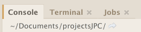
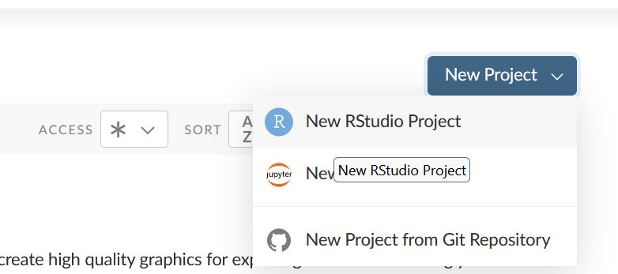
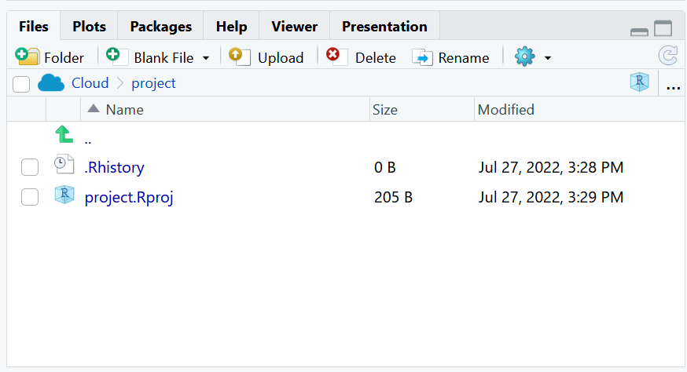
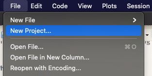
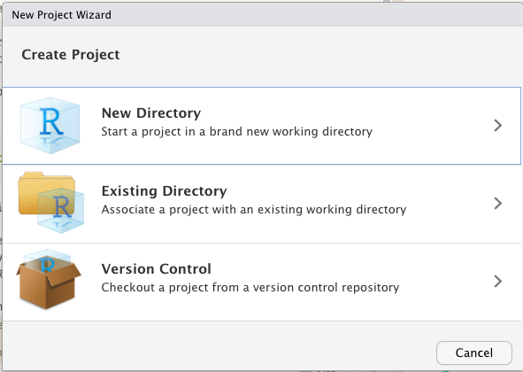
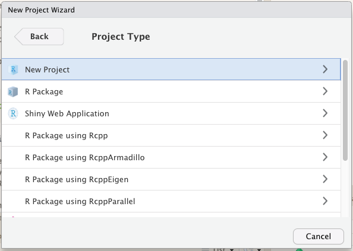
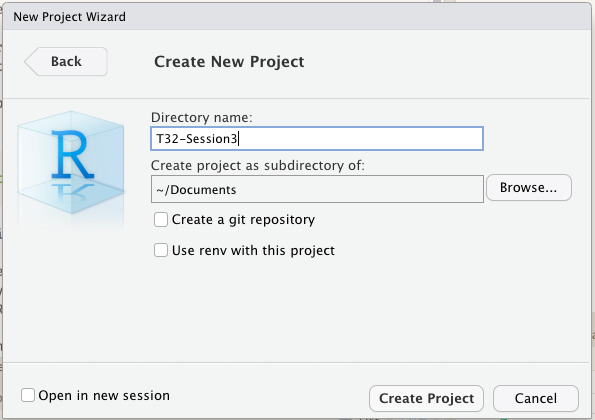

# (PART\*) Session IV {-}

# Reproducible Project Management

Eventually you will be using R for various different analytic tasks not all corresponding to the same project. Knowing what really needs to be saved and establishing a procedure to keep all of the stuff together for any given project will help in preventing a data loss or information loss. To handle these real life situations, you need to determine:

1.  What about your analysis is "real", i.e. what will you save as your lasting record of what happened?

2.  Where does your analysis "live"?

## RStudio Projects

Before tackling RStudio Projects lets orient ourselves a bit in RStudio and answer the questions from the beginning of the chapter as a segue to them.

### What is Real?

As a beginning R user, it's OK to consider your environment (i.e. the objects listed in the environment pane) "real". However, in the long run, you'll be much better off if you consider your R scripts as "real".

With your R scripts (and your data files), you can recreate the environment. It's much harder to recreate your R scripts from your environment! You'll either have to retype a lot of code from memory (making mistakes all the way) or you'll have to carefully mine your R history.

To foster this behavior, its highly recommend that you instruct RStudio not to preserve your workspace between sessions:

```{r echo=F, out.width = '70%', fig.align="center"}
knitr::include_graphics("images/session3/rstudio-workspace.png")
```

This will cause you some short-term pain, because now when you restart RStudio it will not remember the results of the code that you ran last time. But this short-term pain will save you long-term agony because it forces you to capture all important interactions in your code. There’s nothing worse than discovering three months after the fact that you’ve only stored the results of an important calculation in your workspace, not the calculation itself in your code.

### Where does your analysis live?

R has a powerful notion of the working directory. This is where R looks for files that you ask it to load, and where it will put any files that you ask it to save. RStudio shows your current working directory at the top of the console:

```{r echo=F, out.width = '50%', fig.align="center"}

```

And you can print this out in R code by running `getwd()`:

```{r}
getwd()
```

As a beginning R user, it’s OK to let your home directory, documents directory, or any other weird directory on your computer be R’s working directory. It is very important to evolve to organizing your analytic projects into directories and, when working on a project, setting R’s working directory to the associated directory.

**NOT RECOMMENDED**, but you can also set the working directory from within R:

```{r eval=FALSE}
setwd("/path/to/expert/coolProject")
```

### Creating an RStudio Cloud project

R experts keep all the files associated with a project together — input data, R scripts, analytical results, figures. This is such a wise and common practice that RStudio has built-in support for this via projects. You're already used to working with projects from RStudio Cloud which organizes everything into projects automatically. 

Let's create a new project in RStudio Cloud now.

First make sure you are logged in to your RStudio Cloud account (or create a [free account](https://rstudio.cloud/plans/free) if you haven't yet.)

Then from `Your Workspace`, select `New Project > New RStudio Project`. 

```{r echo=F, out.width = '80%', fig.align="center"}

```

It will take a moment for your project to launch. Then you can give it a name. Let's call this `Reproducible Project Example`. Note that you have a `.Rproj` in your file pane. 

```{r echo=F, out.width = '80%', fig.align="center"}

```

Whenever you are in a project, the project is your working directory.


### Creating an RStudio project{#createRproj}

It can be especially useful to create an RStudio Project when working with your own instance of RStudio. An RStudio Project will appear like any other directory in your computer's file system, but will have an `.Rproj` file in it. You can even create projects from existing directories.

Let’s practice creating a project. Click File > New Project, then:

```{r echo=F, out.width = '50%', fig.align="center"}




```

Call your project `Reproducible Project Example` and think carefully about which subdirectory you put the project in. If you don’t store it somewhere sensible, it will be hard to find it in the future!

Once this process is complete, you’ll get a new RStudio project just for this practice. Check that the “home” directory of your project is the current working directory:

```{r eval=FALSE}
getwd()
```

Whenever you refer to a file with a relative path it will look for it here.

Now enter the following commands in the script editor, and save the file, calling it “diamonds.R”. Next, run the complete script which will save a PDF and CSV file into your project directory. 

```{r eval=FALSE}
library(tidyverse)

ggplot(diamonds, aes(carat, price)) + 
  geom_hex()
ggsave("diamonds.pdf")

write_csv(diamonds, "diamonds.csv")
```

Quit RStudio. Inspect the folder associated with your project — notice the .Rproj file. Double-click that file to re-open the project. Notice you get back to where you left off: it’s the same working directory and command history, and all the files you were working on are still open. Because you followed my instructions above, you will, however, have a completely fresh environment, guaranteeing that you’re starting with a clean slate.

In your favorite OS-specific way, search your computer for diamonds.pdf and you will find the PDF (no surprise) but also the script that created it (diamonds.R). This is huge win! One day you will want to remake a figure or just understand where it came from. If you rigorously save figures to files with R code and never with the mouse or the clipboard, you will be able to reproduce old work with ease!

## Version Control and RStudio

```{r echo=F, out.width = '80%', fig.align="center"}
knitr::include_graphics("images/session3/github-Rstudio.jpg")
```

### Why Git?

[Git](https://git-scm.com/) is a version control system. Its original purpose was to help groups of developers work collaboratively on big software projects. Git manages the evolution of a set of files – called a repository – in a sane, highly structured way. If you have no idea what I’m talking about, think of it as the “Track Changes” features from Microsoft Word on steroids.

Git has been re-purposed by the data science community. In addition to using it for source code, we use it to manage the motley collection of files that make up typical data analytical projects, which often consist of data, figures, reports, and, yes, source code.

### What's GitHub?

[GitHub](https://github.com/), [Bitbucket](https://bitbucket.org/), and [GitLab](https://about.gitlab.com/) are online services that provide a home for your Git-based projects on the internet. If you have no idea what I’m talking about, think of them as DropBox but much, much better. The remote host acts as a distribution channel or clearinghouse for your Git-managed project. It allows other people to see your stuff, sync up with you, and perhaps even make changes. These hosting providers improve upon traditional Unix Git servers with well-designed web-based interfaces.

Even for private solo projects, it’s a good idea to push your work to a remote location for peace of mind. Why? Because it’s fairly easy to screw up your local Git repository, especially when you’re new at this. The good news is that often only the Git infrastructure is borked up. Your files are just fine! Which makes your Git pickle all the more frustrating. There are official Git solutions to these problems, but they might require expertise and patience you can’t access at 3a.m. If you’ve recently pushed your work to GitHub, it’s easy to grab a fresh copy, patch things up with the changes that only exist locally, and get on with your life. Don’t get too caught up on public versus private at this point. There are many ways to get private repositories from the major providers for low or no cost. Just get started and figure out if and how Git/GitHub is going to work for you! 

We will not be covering all the in's and outs of version control with Git, Github and all the resources to be found there since our time is limited. Instead you will learn how to:

1. Set up a remote repository on Github

2. Connecting RStudio to Github 

3. Set up a personal access token on Github

4. Checking out a project from a version control remote repository

5. Making some changes, using the Rstudio Git controls and pushing those changes to Github

## Setting up a remote repository on Github{#settingupremote}

First thing we do is navigate to [Github](https://github.com/) and make sure youre logged in. 

Click green “New repository” button. Or, if you are on your own profile page, click on “Repositories”, then click the green “New” button.

How to fill this in:

* Repository name: myrepo (or whatever you wish, we’ll delete this soon anyway).
* Description: “testing my setup” (or whatever, but some text is good for the README).
* Public.
* YES Initialize this repository with a README.
* For everything else, just accept the default.

Click big green button “Create repository.”

Copy the HTTPS clone URL to your clipboard via the green “Clone or Download” button.

## Connecting Rstudio to Github

Here we verify that RStudio can issue Git commands on your behalf. Assuming that you’ve gotten local Git to talk to GitHub, this means you’ll also be able to pull from and push to GitHub from RStudio.

### Introduce yourself to Git

The [usethis](https://usethis.r-lib.org/) package offers an approach to set your Git user name and email from within R as well as setting up a personal access token. To configure git:

```{r eval=FALSE}
## install if needed (do this exactly once):
install.packages("usethis")

library(usethis)
use_git_config(user.name = "Jane Doe", user.email = "jane@example.org")
```

Check what you just did `usethis::git_sitrep()`generates a git situation-report. It can help you confirm things will work as expected; it can also help you diagnose problems:

```{r eval=FALSE}
library(usethis)

git_sitrep()
```

#### Optional: configure Git’s editor

Another Git option that many people eventually configure is the editor. This will come up if you use Git from a shell. At some point, you will fail to give Git what it wants in terms of a commit message and it will kick you into an editor. This can be distressing, if it’s not your editor of choice and you don’t even know how to save and quit. You can enforce your will by executing this in R:

```{r eval=FALSE}
library(usethis)

use_git_config(core.editor = "nano")
```

## Get a personal access token (PAT)

### Create the PAT
In this step you will be creating a PAT. Since GitHub is moving away from username + password to push to their server it will be inevitable that you must set this up to work with GitHub from your local computer and RStudio. To create the token using `usethis` run:
```{r eval=FALSE}
usethis::create_github_token()
```
You will see running this command takes you to a pre-filled form to create a new PAT. You can get to the same page in the browser by clicking on “Generate new token” from (https://github.com/settings/tokens). The advantage of `create_github_token()` is that the `usethis` maintainers have pre-selected some recommended scopes, which you can look over and adjust before clicking “Generate token”.
It is a very good idea to give the token a descriptive name, because one day you might have multiple PATs, e.g., one that’s configured on your main work computer and another that you use from a secondary computer or VM. Eventually, you’ll need to “spring clean” your PATs and this is much less nerve-wracking if you know which PAT is being used where and for what.

You must **store this token somewhere**, because you’ll never be able to see it again, once you leave this browser window. If you somehow goof this up, just generate a new PAT and, so you don’t confuse yourself, delete the lost token. In the moment, we usually copy the PAT to the clipboard, anticipating what we’ll do next: trigger a prompt that lets us store the PAT in the Git credential store. 

### Put your PAT into the Git credential store

Next you need to run:

```{r eval=FALSE}
gitcreds::gitcreds_set()
```

You will have the [gitcreds](https://r-lib.github.io/gitcreds/) package installed, as of usethis v2.0.0, because usethis uses gh, and gh uses gitcreds.

If you don’t have a PAT stored already, it will prompt you to enter your PAT. Paste!

If you do already have a stored credential, `gitcreds::gitcreds_set()` reveals this and will even let you inspect it. This helps you decide whether to keep the existing credential or replace it. When in doubt, embrace a new, known-to-be-good credential over an old one, of uncertain origins.

Here are two great ways to check that all is well:

```{r eval=FALSE}
gh::gh_whoami()

usethis::git_sitrep()
```

Both of these functions reveal whether a GitHub PAT is discovered and provide information about the associated user, the PAT’s scopes, etc.

This step is something you do once. Or, rather, once per machine, per PAT. From this point on, usethis and its dependencies should be able to automatically retrieve and use this PAT.

## Checking out a project from a version control remote repository

Hopefully it has been a joy configuring your Git setup on your computer. Now we will put all of that machinery to work and test it out. 
Picking up were we left off when [Setting up a remote repository](#settingupremote) copy the HTTPS clone URL to your clipboard via the green “Clone or Download” button.

### Clone the new GitHub repository to your computer via RStudio

In RStudio, start a new Project [review here](#createRproj):

* File > New Project > Version Control > Git. In “Repository URL”, paste the URL of your new GitHub repository. It will be something like this `https://github.com/j-p-courneya/T32_Session3_Practice.git`.

  + Do you NOT see an option to get the Project from Version Control? Restart RStudio and try again. Still no luck? Go to [gitwithr chapter 13](https://happygitwithr.com/rstudio-see-git.html) for tips on how to help RStudio find Git.

* Accept the default project directory name, e.g. T32_Session3_Practice, which coincides with the GitHub repo name.

* Take charge of – or at least notice! – where the Project will be saved locally. A common rookie mistake is to have no idea where you are saving files or what your working directory is. Pay attention. Be intentional. Personally, I would do this in `~/Documents`.

* I suggest you check “Open in new session”, as that’s what you’ll usually do in real life.

* Click “Create Project”.

You should find yourself in a new local RStudio Project that represents the new test repo we just created on GitHub. This should download the README.md file from GitHub. Look in RStudio’s file browser pane for the README.md file.

## Making some changes, save, commit. 

From RStudio, modify the `README.md` file, e.g., by adding the line “This is a line from RStudio”. Save your changes.

Commit these changes to your local repo. How?

From RStudio:

* Click the “Git” tab in upper right pane.

* Check “Staged” box for `README.md`.

* If you’re not already in the Git pop-up, click “Commit”.

* Type a message in “Commit message”, such as “Commit from *
RStudio”.

* Click “Commit”.

## Push your local changes online to GitHub

Click the green “Push” button to send your local changes to GitHub.  You should see some message along these lines.

```{r eval=FALSE}
[master dc671f0] blah
 3 files changed, 22 insertions(+)
 create mode 100644 .gitignore
 create mode 100644 myrepo.Rproj
```

## Confirm the local change propagated to the GitHub remote

Go back to the browser. I assume we’re still viewing your new GitHub repo.

Refresh.

You should see the new “This is a line from RStudio” in the README.

If you click on “commits”, you should see one with the message “Commit from RStudio”.

If you have made it this far, you are DONE with set up.

## Clean up

**Local** When you’re ready to clean up, you can delete the local repo any way you like. It’s just a regular directory on your computer.

**GitHub** In the browser, go to your repo’s landing page on GitHub. Click on “Settings”.

Scroll down, click on “delete repository,” and do as it asks.

