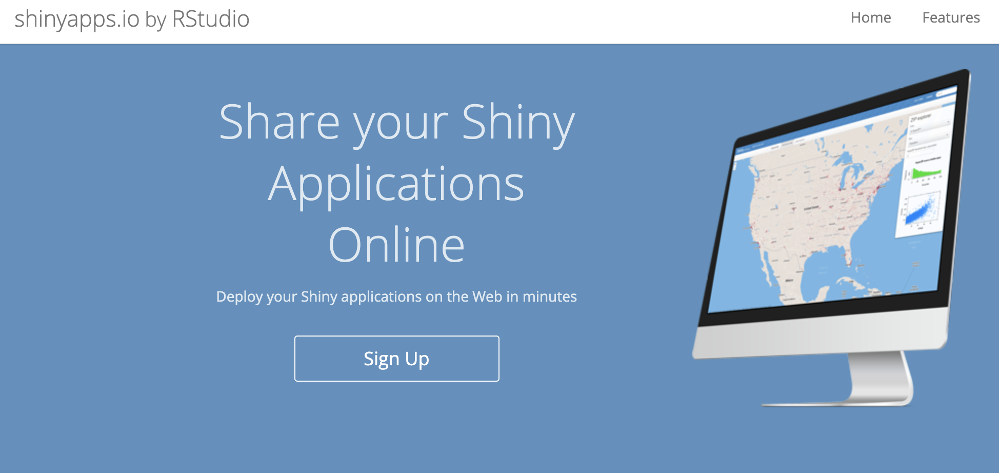

# Shiny Apps

[Shiny][shiny-official-web] is a package from RStudio that can be used to build interactive web pages with R. While that may sound scary because of the words "web pages", Shiny is geared to R users who have zero experience with web development, and you do not need to know any HTML/CSS/JavaScript.

You can do quite a lot with Shiny: think of it as an easy way to make an interactive web page, and that web page can seamlessly interact with R and display R objects (plots, tables, of anything else you do in R). To get a sense of the wide range of things you can do with Shiny, you can visit Rstudio's Shiny gallery (<https://shiny.rstudio.com/gallery/>), which hosts a Shiny user showcase of apps contributed by the Shiny app developer community (also categorized by application domain), demos for getting started with shiny and input and output widgets .

## Shiny app basics {#shiny-tutorial-2}

Every Shiny app is composed of two parts: a web page that shows the app to the user called the `UI` (user interface), and a computer that powers the app known as the `server`. The computer that runs the app can either be your own laptop (such as when you're running an app from RStudio) or a server somewhere else. You, as the Shiny app developer, need to write these two parts. 

If you look at the [app](http://daattali.com/shiny/bcl/) that can be built following the instructions here: [tutorial](http://deanattali.com/blog/building-shiny-apps-tutorial/) , the page that you see is built with the UI code. UI is just a web document that the user gets to see, it's HTML that is produced for you from code written using Shiny's functions. The UI is responsible for creating the layout of the app and telling Shiny exactly where things go like input controls to adjust the price or choose a country or where the plot and table appear on the page. The server is responsible for the logic of the app; it's the set of instructions that tell the web page what to show, like the data for the table and the plot seen, when the user interacts with the page.

## Create a basic Shiny app

You can think of building your Shiny apps in 3 stages, basic, layout and input/output/logic. The basic stage starts with a template of the fundamental required components of your R script for bringing your app to life. We will start by looking at the basics. 

All Shiny apps follow the same template:

```{r echo=F, out.width = '100%', fig.align="center"}
knitr::include_graphics("images/session3/shiny_anatomy.png")
```

```{r eval=FALSE}
# Load Shiny ----
library(shiny)
#################

# UI code for running the app ----
ui <- fluidPage(
  "Hello, world!"
)
##################################

# Server code for running the app ----
server <- function(input, output, session) {
}
##################################

# Create the Shiny app ----
shinyApp(ui, server)
###########################
```

This template R script is by itself a working minimal Shiny app that doesn't do much. It calls `library(shiny)` to load the `Shiny` package, initializes a `UI` with `ui <- fluidPage()` containing the words "Hello, world!", it then specifies the behavior of our app by defining a function and assigning it to `server`, this (server) function is empty so it doesn't do anything, lastly the Shiny function `shinyApp(ui, server)` is added for building the app. Notice the arguments to `shinyApp()` which uses the parts `ui` and `server` in the script. 

### Basic Shiny app R script

::: {.shaded .tip data-latex=""}

1. Create a new folder in your Rstudio project called `/basicShinyApp`
2. Create a new file named `app.R` and save it in the folder you just created `/basicShinyApp`
3. Copy the above basic Shiny app template code into the file. 
4. It is **very important** that the name of the file is `app.R`, otherwise R will not recognize it as a Shiny app. It is also **very important** that you place this app in its own folder, and not in a folder that already has other R scripts or files, unless those scripts and files are used by your app.
:::

### Run the basic Shiny app

After saving the file, RStudio should recognize that this is a Shiny app, and you should see the usual *Run* button at the top change to *Run App*.

```{r echo = FALSE, out.width = '100%', fig.align="center"}
knitr::include_graphics("images/session3/shiny_runapp.png")
```

If you don't see the Run App button, it means you either have a very old version of RStudio, don't have Shiny installed, or didn't follow the file naming conventions.

Click the Run App button, and now your app should run. You will have an amazing message in your Shiny App that looks like this:

```{r echo = FALSE, out.width = '50%', fig.align="center"}

```

Take a moment and see that the R Console has some text printed in the form of `Listening on http://127.0.0.1:5274` and that a little stop sign appeared at the top of the R Console. You'll also notice that you can't run any commands in the R Console. This is because R is busy - your R session is currently powering a Shiny app and listening for user interaction (which won't happen because the app has no inputs in it yet).

Click the stop button to stop the app, or press the Escape key.

```{r echo = FALSE, out.width = '100%', fig.align="center"}
knitr::include_graphics("images/session3/shiny_stopapp.png")
```

You may have noticed that when you click the *Run App* button, all it's doing is just running the function `shiny::runApp()` in the R Console You can run that command instead of clicking the button if you prefer.

### Challenge

::: {.shaded .question data-latex=""}

**Exercise:** Try running the empty app using the `runApp()` function instead of using the *Run App* button.
::: 

### Create a Shiny app using separate UI and server files

::: {.shaded .tip data-latex=""}
Another way to define a Shiny app is by separating the UI and server code into two files: `ui.R` and `server.R`. This is the preferable way to write Shiny apps when the app is complex and involves more code. If you want to break up your app into these two files, you simply put all code that is assigned to the `ui` variable in `ui.R` and all the code assigned to the `server` function in `server.R`. When RStudio sees these two files in the same folder, it will know you're writing a Shiny app.
:::

### Let RStudio fill out a Shiny app template for you

You can also create a new Shiny app using RStudio's menu by selecting *File \> New File \> Shiny Web App...*. If you do this, RStudio will let you choose if you want a single-file app (`app.R`) or a two-file app (`ui.R`+`server.R`). RStudio will initialize a simple functional Shiny app with some code in it.

## Create the Shiny App layout 

Now that you have the basics down, we will move to the layout stage of building a Shiny app. This will surely make the app more interesting. Imagine you want to create an app that allows the user to select the name of an R dataset from the `datasets` package as input and provides the results of `summary()` and a table view of the dataset as output. In thinking about the UI for this app you will want to imagine where the Name of the app will appear, where the input selectors are located on the page and where the output will go. Keep in mind creating a layout is not required but having it makes the app much more user friendly and look like a pro made it.

Building on top of the basic code we already wrote for our an app we will add functions for creating the layout for the different parts of the app `UI`. 

Replace your `UI` code in with this:

```{r eval=FALSE}
# Load Shiny ----
library(shiny)
#################

# Define UI for dataset viewer app ----
ui <- fluidPage(# App title ----
                titlePanel("R Datasets Viewer"),
                # Sidebar layout which houses the input and output definitions ----
                sidebarLayout(
                  # Sidebar panel for inputs ----
                  sidebarPanel("Hello World!!!"),
                  
                  # Main panel for displaying outputs ----
                  mainPanel("Hello World!!!")))
#######################################

# Server code for running the app ----
server <- function(input, output, session) {
}
##################################

# Create the Shiny app ----
shinyApp(ui, server)
###########################
```

In this code you're providing a layout function with `fluidPage()` to set up the visual structure of the page. `fluidPage()` is a function from the shiny package and like all R functions we can pass arguments even other functions, these of which are the elements to include in the layout. The first argument we see is `titlePanel()`, which allows us to provide the title for our app. The next argument we provide is `sidebarLayout()`. This will create a layout (`sidebarLayout()`) with a sidebar (`sidebarPanel()`) and main area (`mainPanel()`). The arguments for sidebarLayout() will allow us to define the location of our input controls and location in the app of the outputs. You will notice that some simple text `"Hello World!"` has been added to see how this all looks when the app is run. The next stage of building our app we will add the actual code for defining these components as well as the logic for running the app. At this stage of app building we dont change anything in the server code. Take a moment and run the app and see how it looks! 

## Create input/output/logic of the Shiny app

In the final stage of creating our Shiny app we will be defining our inputs, outputs and the server logic. This stage is where our app really shapes up and we end up with a beautiful data application for whatever we want. In the case of this text an app to look at a summary and table of a dataset our user selects from the R `datasets` package.

### Code to build the app including inputs/outputs/logic

To start we will view all the code which can be copied and placed into an app.R file and run. In the proceeding text we will examine each part.

```{r input-output-logic, eval=FALSE}
# Load Shiny and Datasets package ----
library(shiny)
#################

# Define UI for dataset viewer app ----
ui <- fluidPage(# App title ----
                titlePanel("R Datasets Viewer"),
                # Sidebar layout which houses the input and output definitions ----
                sidebarLayout(
                  # Sidebar panel for inputs ----
                  sidebarPanel(
                    # Input: Select a dataset ----
                    selectInput(
                      inputId = "dataset",
                      label = "Choose Dataset",
                      choices = ls("package:datasets")
                    ),
                    # Include clarifying text ----
                    helpText(
                      "Note: to View the entirety of the dataset selected",
                      "you may need to scroll."
                    )
                  ),
                  
                  # Main panel for displaying outputs ----
                  mainPanel(
                    # Output: Header + summary of the dataset selected ----
                    h4("Summary"),
                    verbatimTextOutput(outputId = "summary"),
                    
                    # Output: Header + table of the dataset selected ----
                    h4("Observations"),
                    tableOutput(outputId = "table")
                  )
                  ))
#######################################

# Server code for running the app ----
server <- function(input, output, session) {
  # Generate a summary of the dataset ----
  output$summary <- renderPrint({
    selectedDataset <- get(input$dataset, "package:datasets")
    summary(selectedDataset)
  })
  
  # Generate a table of the selected dataset ----
  output$table <- renderTable({
    selectedDataset <- get(input$dataset, "package:datasets")
    print(selectedDataset)
  })
}
##################################

# Create the Shiny app ----
shinyApp(ui, server)
###########################
```

### Defining UI inputs for app

```{r definingUIInput, eval=FALSE}
# Sidebar panel for inputs ----
                  sidebarPanel(
                    # Input: Select a dataset ----
                    selectInput(
                      inputId = "dataset",
                      label = "Choose Dataset",
                      choices = ls("package:datasets")
                    ),
                    # Include clarifying text ----
                    helpText(
                      "Note: to View the entirety of the dataset selected",
                      "you may need to scroll."
                    )
                  ),
```

Shiny provides many UI inputs, Shiny functions which correspond to user interface elements that prompt the user for input values or interaction with an app. UI input functions follow the naming convention, `{typeOfInput}Input()` You can see options available on the Shiny reference page (https://shiny.rstudio.com/reference/shiny/1.7.0/) in the section UI Inputs.  

The app we are developing allows the user to investigate a dataset from the `datasets` package. We therefore need an input that provides a list of selections for the user to select one. To create this we use the `selectInput()` function, make sure to call the function inside `sidebarPanel()`. As arguments to `selectInput()` we have to provide an inputID `"dataset"` - the input slot that will be used to access the value(we will use this in the server function), a label `"Choose Dataset"` - a label that will display in the selector (control) in the `UI`, and the choices the user is provided. The choices are generated from a call to `ls()` with the argument `package:datasets` (try that out in your console for fun!). You will also see we have added some text for the user with `helpText()` that informs them of what is going on in the output when they select a dataset.

### Defining UI outputs for app.

```{r definingUIOutput, eval=FALSE}
# Main panel for displaying outputs ----
                  mainPanel(
                    # Output: Header + summary of the dataset selected ----
                    h4("Summary"),
                    verbatimTextOutput(outputId = "summary"),
                    
                    # Output: Header + table of the dataset selected ----
                    h4("Observations"),
                    tableOutput(outputId = "table")
                  )
                  ))
```
Shiny also provides many UI outputs, Shiny functions for creating user interface elements that, in conjunction with rendering functions (discussed in the server logic section next), display different kinds of output from your app. UI output functions follow the naming convention, `{typeOfOutput}Output()`. You can see options available on the Shiny reference page (https://shiny.rstudio.com/reference/shiny/1.7.0/) in the section UI Outputs

In our app we will define the outputs we want in the `mainPanel()` section of the app `UI`. The first output we want is a header for naming the output + summary of the dataset selected. The header is defined with a call to `h4()` with the argument `"Summary"`. The first UI output we encounter is `verbatimTextOutput()` with its argument `outputId = "summary"`. You might be wondering where `outputID` comes from(great question!), that is defined using a render function and we will discuss it in the next section!  Our second output in the app is a header + table of the dataset selected. The header is defined with a call to `h4()` with the argument `"Observations"` and table output is defined with... a call to  `tableOutput()` with its argument `outputId = "table"`. Thats it! You have defined your inputs and outputs, spend some time poking around to see how each of these functions operate under the hood. Oh! and remember to close all parentheses, this has been a major pain-point for many Shiny app developers (especially the author).

### Defining the server logic

```{r definingServerLogic, eval=FALSE}
# Server code for running the app ----
server <- function(input, output, session) {
  # Generate a summary of the dataset ----
  output$summary <- renderPrint({
    selectedDataset <- get(input$dataset, "package:datasets")
    summary(selectedDataset)
  })
  
  # Generate a table of the selected dataset ----
  output$table <- renderTable({
    selectedDataset <- get(input$dataset, "package:datasets")
    print(selectedDataset)
  })
}
##################################

# Create the Shiny app ----
shinyApp(ui, server)
###########################
```
Defining the server function is like putting a brain in the app. Now it can receive inputs and tell the app what to do. Rendering functions are functions that you use in your application’s server side code, assigning them to outputs that appear in your user interface. Each `render{Type}` function is designed to produce a particular type of output (e.g. text, tables, and plots), and is often paired with a `{type}Output function`. For example, in this app, `renderPrint()` is paired with `verbatimTextOutput()` to display a statistical summary with fixed-width (verbatim) text, and `renderTable()` is paired with `tableOutput()` to output the data in a table.

Lets talk about **inputID's** and **outputID's**. When we defined our UI input with `selectInput()` we provided the argument `inputId = "dataset"` this gives the word `"dataset"` special status in the app making it the "input slot" that will be used to access the value. In this app you will see `input$dataset` put to work in the render functions. Before getting to that, lets talk about outputID's. In the UI outputs you see the arguments `outputId = "summary"` and `outputId = "table"`. These outputID's are defined when a a render function is assigned to them, they will appear in the server side code of the app we're building as `output$summary` and `output$table`. However when you use them in the UI output arguments you only use the keyword (`Id`) `"summary"` and `"table"`. Keep in mind the word you choose is up to you but keeping it consistent with what output it is used with is helpful in readability of your code. Lets walk through writing the server side code. 

We start with the mandatory definition of the server function `server <- function(input, output, session) {`. Following this we are using the `renderPrint({...})` function for generating the summary (recall that `summary()` prints a statistical summary to the console in R). In the body of the function are two lines of code `selectedDataset <- get(input$dataset, "package:datasets")` which calls `get()` with the arguments `input$dataset` (you know where this comes from!) and `"package:datasets"` and assigns that to the object `selectedDataset` the next line is a call to `summary(selectedDataset)` which is what is assigned to `output$summary` (this is made available to our UI output functions!). 

The second render function we will define `renderTable({...})` is for generating a table of the selected dataset. In the body of the function are two lines of code `selectedDataset <- get(input$dataset, "package:datasets")` which calls `get()` with the arguments `input$dataset` (you know where this comes from!) and `"package:datasets"` and assigns that to the object `selectedDataset` the next line is a call to `print(selectedDataset)` which is assigned to `output$table` (again, this is available to the UI output functions and ready to be used in your awesome Shiny app!)
  
### Run the interactive web application
Make sure you have the mandatory call to `shinyApp()` and its time to run your app! Run the app now and see what happens when you change the input! You will joyfully notice that the summary and table update whenever you change the input data from the dropdown menu. This dependency is created implicitly because we've referred to `input$dataset` within the output functions. `input$dataset` is populated with the current value of the UI component with id `dataset`, and will cause the outputs to automatically update whenever that value changes. This is a fundamental concept in Shiny known as **reactivity**, outputs automatically react when their inputs change. There is much to learn about this!

## Host your Shiny App

```{r echo = FALSE, out.width = '80%', fig.align="center"}

```

Once you have built a killer Shiny App you will want to show all of your friends and colleagues. Fortunately when youre starting out this can be done at no cost using the power of [shinyapps.io][shinyapps-web]! 

Deployment to the web is done using integrated Rstudio resources {width="165"}. 

When youre ready to step up your hosting game you can evolve to a paid tier within [shinyapps.io][shinyapps-web], or host on your own server or a number of other places. Have fun with it!

## Resources

Shiny is a very popular package and has lots of resources on the web. Here's a compiled list of a few recommended resources which are all fairly easy to read and understand.

-   [Shiny official website][shiny-official-web]
-   [Shiny official tutorial][shiny-official-tutorial]
-   [Shiny cheatsheet][shiny-cheatsheet]
-   [Lots of short useful articles about different topics in Shiny - **highly recommended**][shiny-articles]
-   [Shiny in R Markdown](http://rmarkdown.rstudio.com/authoring_shiny.html)
-   Get help from the [Shiny Google group][shiny-google-groups] or [StackOverflow][shiny-stack-overflow]
-   [Publish your apps for free with shinyapps.io][shinyapps-web]
-   [Host your app on your own Shiny server][shiny-server-setup]
-   [Learn about how reactivity works][shiny-reactivity]
-   [Learn about useful debugging techniques][shiny-debugging]

```{r links, child="links.md"}
```
