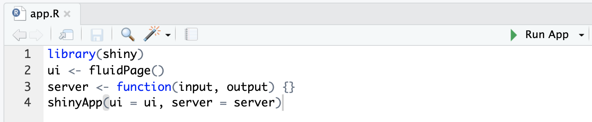

# Shiny Apps

[Shiny][shiny-official-web] is a package from RStudio that can be used to build interactive web pages with R. While that may sound scary because of the words "web pages", Shiny is geared to R users who have zero experience with web development, and you do not need to know any HTML/CSS/JavaScript.

You can do quite a lot with Shiny: think of it as an easy way to make an interactive web page, and that web page can seamlessly interact with R and display R objects (plots, tables, of anything else you do in R). To get a sense of the wide range of things you can do with Shiny, you can visit Dean Attali's Shiny server (<https://attalitech.com/#portfolio>), which hosts a variety of Shiny apps.

## Shiny app basics {#shiny-tutorial-2}

Every Shiny app is composed of two parts: a web page that shows the app to the user called the `UI` (user interface), and a computer that powers the app known as the `server`. The computer that runs the app can either be your own laptop (such as when you're running an app from RStudio) or a server somewhere else. You, as the Shiny app developer, need to write these two parts. 

If you look at the [app](http://daattali.com/shiny/bcl/) that can be built following the instructions here: [tutorial](http://deanattali.com/blog/building-shiny-apps-tutorial/) , the page that you see is built with the UI code. UI is just a web document that the user gets to see, it's HTML that you write using Shiny's functions. The UI is responsible for creating the layout of the app and telling Shiny exactly where things go like controls to adjust the price or choose a country or where the plot and table appear on the page. The server is responsible for the logic of the app; it's the set of instructions that tell the web page what to show, like the data for the table and the plot seen, when the user interacts with the page.

## Create an empty Shiny app

All Shiny apps follow the same template:

```{r echo=F, out.width = '100%', fig.align="center"}
knitr::include_graphics("images/session3/shiny_anatomy.png")
```

```{r eval=FALSE}
library(shiny)
ui <- fluidPage(
  "Hello, world!"
)
server <- function(input, output, session) {
}
shinyApp(ui, server)
```

This template is by itself a working minimal Shiny app that doesn't do much. It calls `library(shiny)` to load the shiny package, initializes a UI containing the words "Hello, world!" and then specifies the behavior of our app by defining a server function, this server is empty so it doesnt do anything, and runs an app using `shinyApp(ui, server)` using the parts from `UI` and `server`. 

Copy the above template into a new file named `app.R` in a new folder. It is **very important** that the name of the file is `app.R`, otherwise it would not be recognized as a Shiny app. It is also **very important** that you place this app in its own folder, and not in a folder that already has other R scripts or files, unless those other files are used by your app.

After saving the file, RStudio should recognize that this is a Shiny app, and you should see the usual *Run* button at the top change to *Run App*.

```{r echo = FALSE, out.width = '100%', fig.align="center"}

```

If you don't see the Run App button, it means you either have a very old version of RStudio, don't have Shiny installed, or didn't follow the file naming conventions.

Click the Run App button, and now your app should run. You will have an amazing message in your Shiny App that looks like this:

```{r echo = FALSE, out.width = '50%', fig.align="center"}
knitr::include_graphics("images/session3/shiny_helloworld.png")
```

Take a moment and see that the R Console has some text printed in the form of `Listening on http://127.0.0.1:5274` and that a little stop sign appeared at the top of the R Console. You'll also notice that you can't run any commands in the R Console. This is because R is busy - your R session is currently powering a Shiny app and listening for user interaction (which won't happen because the app has no inputs in it yet).

Click the stop button to stop the app, or press the Escape key.

```{r echo = FALSE, out.width = '100%', fig.align="center"}

```

You may have noticed that when you click the *Run App* button, all it's doing is just running the function `shiny::runApp()` in the R Console You can run that command instead of clicking the button if you prefer.

**Exercise:** Try running the empty app using the `runApp()` function instead of using the *Run App* button.

### Alternate way to create a Shiny app: separate UI and server files

Another way to define a Shiny app is by separating the UI and server code into two files: `ui.R` and `server.R`. This is the preferable way to write Shiny apps when the app is complex and involves more code. If you want to break up your app into these two files, you simply put all code that is assigned to the `ui` variable in `ui.R` and all the code assigned to the `server` function in `server.R`. When RStudio sees these two files in the same folder, it will know you're writing a Shiny app.

### Let RStudio fill out a Shiny app template for you

You can also create a new Shiny app using RStudio's menu by selecting *File \> New File \> Shiny Web App...*. If you do this, RStudio will let you choose if you want a single-file app (`app.R`) or a two-file app (`ui.R`+`server.R`). RStudio will initialize a simple functional Shiny app with some code in it.

## An example Shiny App

Now that you have the basics, add the following code, run the app and check out the results:

Replace your `UI` code with this:

```{r eval=FALSE}
ui <- fluidPage(
  selectInput("dataset", label = "Dataset", choices = ls("package:datasets")),
  verbatimTextOutput("summary"),
  tableOutput("table")
)
```

Here youre providing a layout function with `fluidPage()` to set up the visual structure of the page, an input control for user interaction with `selectInput()`, `verbatimTextOutput()` and `tableOutput()` are output controls that tell Shiny where to put rendered output. Spend some time poking around to see how each of these functions operate under the hood.

Replace your `server` code with this:

```{r eval=FALSE}
server <- function(input, output, session) {
  output$summary <- renderPrint({
    dataset <- get(input$dataset, "package:datasets")
    summary(dataset)
  })
  
  output$table <- renderTable({
    dataset <- get(input$dataset, "package:datasets")
    dataset
  })
}
```

Defining the server function is like putting a brain in the app. Now it can receive signals and tell the app what to do. The left-hand side of the assignment operator (`<-`), `output$ID`, indicates that you're providing the recipe for the Shiny output with that ID. The right-hand side of the assignment uses a specific render function to wrap some code that you provide. Each `render{Type}` function is designed to produce a particular type of output (e.g. text, tables, and plots), and is often paired with a `{type}Output function`. For example, in this app, `renderPrint()` is paired with `verbatimTextOutput()` to display a statistical summary with fixed-width (verbatim) text, and `renderTable()` is paired with `tableOutput()` to show the input data in a table.

Run the app now and see what happens when you change the input! You will joyfully notice that the summary and table update whenever you change the input data from the dropdown menu. This dependency is created implicitly because we've referred to `input$dataset` within the output functions. `input$dataset` is populated with the current value of the UI component with id `dataset`, and will cause the outputs to automatically update whenever that value changes. This is a fundamental concept in Shiny known as **reactivity**, outputs automatically react when their inputs change. There is much to learn about this!

## Host your Shiny App

```{r echo = FALSE, out.width = '80%', fig.align="center"}
knitr::include_graphics("images/session3/shinappsio.png")
```

Once you have built a killer Shiny App you will want to show all of your friends and colleagues. Fortunately when youre starting out this can be done at no cost using the power of [shinyapps.io][shinyapps-web]! 

Deployment to the web is done using integrated Rstudio resources {width="165"}. 

When youre ready to step up your hosting game you can evolve to a paid tier within [shinyapps.io][shinyapps-web], or host on your own server or a number of other places. Have fun with it!

## Resources

Shiny is a very popular package and has lots of resources on the web. Here's a compiled list of a few recommended resources which are all fairly easy to read and understand.

-   [Shiny official website][shiny-official-web]
-   [Shiny official tutorial][shiny-official-tutorial]
-   [Shiny cheatsheet][shiny-cheatsheet]
-   [Lots of short useful articles about different topics in Shiny - **highly recommended**][shiny-articles]
-   [Shiny in R Markdown](http://rmarkdown.rstudio.com/authoring_shiny.html)
-   Get help from the [Shiny Google group][shiny-google-groups] or [StackOverflow][shiny-stack-overflow]
-   [Publish your apps for free with shinyapps.io][shinyapps-web]
-   [Host your app on your own Shiny server][shiny-server-setup]
-   [Learn about how reactivity works][shiny-reactivity]
-   [Learn about useful debugging techniques][shiny-debugging]

```{r links, child="links.md"}
```
